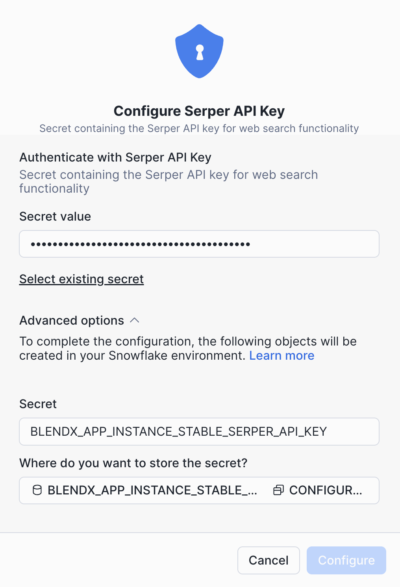

# BlendX - AI Workflow Platform

BlendX is a native Snowflake application that enables you to build and execute AI workflows using CrewAI.

## Features

### NL Generator Chat
Generate AI workflows from natural language descriptions:
- **YAML Configuration**: Complete CrewAI workflow definition
- **Rationale**: Explanation of the workflow design decisions
- **Mermaid Diagram**: Visual representation of the workflow

### Workflow Management
- **Workflow History**: Browse, search, and manage saved workflows
- **Workflow Details**: View full configuration with Rationale, YAML, and Diagram tabs
- **Save Workflows**: Store generated workflows with custom titles

### Workflow Execution
- **Run Workflow**: Execute workflows using ephemeral execution (no data persistence)
- **List Executions**: View all executions for a specific workflow
- **Execution Details**: View execution results, status, and error messages
- **Real-time Monitoring**: Track execution progress with elapsed time

### System Tests
Diagnostic tools to verify system connectivity:
- **Test Cortex**: Verify Snowflake Cortex LLM connection
- **Test LiteLLM**: Verify LiteLLM integration
- **Test Secrets**: Verify API keys configuration
- **Test Serper**: Verify Serper search API integration

### Crew Execution Tests
- **Run Test Crew**: Execute the default CrewAI workflow
- **Run Test Crew External Tool**: Execute a crew with external tools (Serper)
- **List Test Executions**: View recent test execution history

## Quick Start

### Local Development

To run BlendX locally with Docker Compose:

1. Configure environment:
```bash
cp .env.example .env
# Edit .env with your Snowflake credentials and API keys
```

2. Start services:
```bash
docker-compose up
```

3. Access the application at http://localhost:8000

For detailed local development instructions, see [LOCAL_DEVELOPMENT.md](LOCAL_DEVELOPMENT.md)

### Production Deployment (Snowflake Native App)

For deploying to Snowflake as a Native App, see [scripts/README.md](scripts/README.md)

## Prerequisites

1. Install Docker
    - [Windows](https://docs.docker.com/desktop/install/windows-install/)
    - [Mac](https://docs.docker.com/desktop/install/mac-install/)
    - [Linux](https://docs.docker.com/desktop/install/linux-install/)


## Set your SnowCLI connection (optional, need to be accountadmin)

We use your default connection to connect to Snowflake and deploy the images / app. Set your
default connection by modifying your `config.toml` file or by exporting the following environment variable:

```sh
export SNOWFLAKE_DEFAULT_CONNECTION_NAME=<your connection name>
```

## Deploy the application

Deploy the app package and instance as such:

1. Run provider setup:
```sh
./scripts/provider-setup.sh
```

2. Deploy in setup mode:
```sh
./scripts/deploy.sh --setup-mode
```

3. Edit consumer_example.sql to set your Serper API key:
```sh
# Edit scripts/sql/consumer_example.sql and set your SERPER_API_KEY
```

4. Run consumer setup:
```sh
snow sql -f scripts/sql/consumer_example.sql --connection mkt_blendx_demo
```

5. Create the application:
```sh
./scripts/create-application.sh
```

6. Go to the Snowflake UI and **grant privileges** and **activate** the app.

   When the application is opened for the first time, you will be prompted to grant the following account-level privileges to it:

   - IMPORT PRIVILEGES ON SNOWFLAKE DB
   - EXTERNAL ACCESS INTEGRATION

   Click on the `Grant` button to proceed.

   

7. In the app UI, go to **Connections** and configure the secret with your API keys.
   Once privileges are granted, a new `Activate` button should appear. Click the button and wait until the application is fully activated.

   


8. Deploy the application:
```sh
./scripts/deploy.sh
```

9. Get url to access the app:
```sh
snow sql -q "USE ROLE nac_test; CALL spcs_app_instance_test.app_public.app_url();" --connection mkt_blendx_demo```
```
### Other commands

- Clean up / remove app:
```sh
./scripts/cleanup.sh
```

- Restart the app (calls stop and start):
```sh
./scripts/restart.sh
```

## User Interface Guide

### Main Layout

The interface is divided into two main sections:

1. **Left Sidebar**: Test controls and diagnostic tools
2. **Main Area**: Chat interface and workflow history

### Generating a Workflow

1. Type a workflow description in the chat input
2. Press `Ctrl+Enter` (or `Cmd+Enter` on Mac) or click **Send**
3. Wait for processing (progress shown in real-time)
4. View results in three tabs: **Rationale**, **YAML**, **Diagram**
5. Use **Copy** buttons to copy YAML or Mermaid code
6. Click **Save** to store the workflow to history

### Managing Workflows

1. Click **Load History** in the chat header to view saved workflows
2. Click on a workflow card to see full details
3. From the details dialog you can:
   - View Rationale, YAML, and Diagram tabs
   - Click **List Executions** to see all executions for that workflow
   - Click **Run Workflow** to execute the workflow

### Viewing Executions

From the Workflow Details dialog:

1. Click **List Executions** to open the executions dialog
2. View a table with all executions showing:
   - Execution ID
   - Status (COMPLETED, PROCESSING, ERROR)
   - Start and update timestamps
3. Click **View** on any execution to see full details including results or errors

### Running Workflows

1. From Workflow Details, click **Run Workflow**
2. Optionally provide input data in the input dialog
3. Monitor execution progress in real-time
4. View results when completed or error messages if failed

### Status Colors

| Color | Status |
|-------|--------|
| Green | COMPLETED |
| Blue | PROCESSING |
| Orange | PENDING |
| Red | ERROR / FAILED |

## API Reference

### Crew Endpoints

| Endpoint | Method | Description |
|----------|--------|-------------|
| `/crew/start` | POST | Start test crew execution |
| `/crew/start-external-tool` | POST | Start external tool crew |
| `/crew/status/{execution_id}` | GET | Get execution status |
| `/crew/executions` | GET | List all executions |
| `/crew/executions/workflow/{workflow_id}` | GET | List executions for a workflow |

### NL Generator Endpoints

| Endpoint | Method | Description |
|----------|--------|-------------|
| `/nl-ai-generator-async` | POST | Generate workflow from natural language |
| `/nl-ai-generator-async/{workflow_id}` | GET | Get workflow status |
| `/nl-ai-generator-async/workflows` | GET | List workflow history |
| `/nl-ai-generator-async/{workflow_id}` | PUT | Update workflow |

### Ephemeral Execution Endpoints

| Endpoint | Method | Description |
|----------|--------|-------------|
| `/ephemeral/run-crew-async` | POST | Run crew without persistence |
| `/ephemeral/run-flow-async` | POST | Run flow without persistence |
| `/ephemeral/status/{execution_id}` | GET | Get ephemeral execution status |

