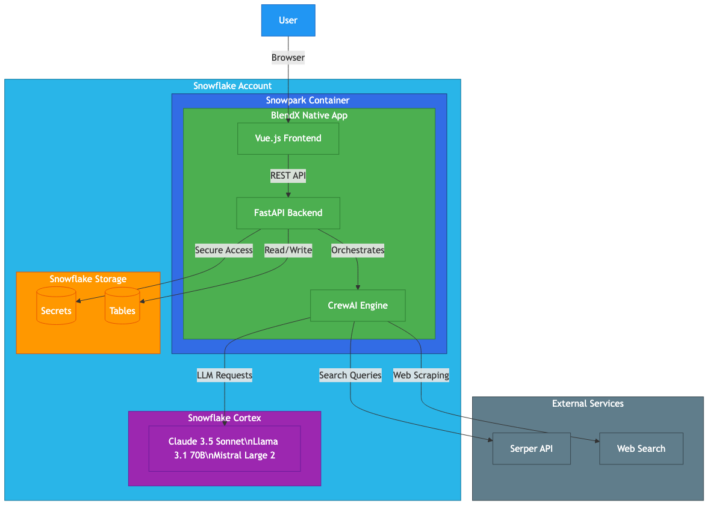

# BlendX CrewAI Agent Workflows


## Overview

BlendX Snowflake Native Application enables you to run CrewAI agent workflows directly within your Snowflake environment, powered by Snowflake Cortex LLMs.

### Key Features

- **Multi-Agent AI Workflows**: Run sophisticated multi-agent AI workflows using the CrewAI framework
- **Snowflake Cortex Integration**: Powered by Snowflake Cortex LLMs - no external API keys required for LLM access
- **Natural Language Workflow Generator**: Create complex workflows using plain English descriptions
- **External Tool Integration**: Web search capabilities via Serper API
- **Secure Execution**: Runs within Snowpark Container Services (SPCS)
- **Built-in Secret Management**: Through Snowflake references
- **Interactive Web Interface**: For generating and monitoring workflows

---

## Architecture



---

## Installation

### Step 1: Install the Application

Click "Get" in the Snowflake Marketplace to install the application in your Snowflake account.

### Step 2: Configure Serper API (Optional)

For web search capabilities, create a secret with your Serper API key:

```sql
CREATE DATABASE IF NOT EXISTS secrets_db;
CREATE SCHEMA IF NOT EXISTS secrets_db.app_secrets;

CREATE SECRET IF NOT EXISTS secrets_db.app_secrets.serper_api_key
  TYPE = GENERIC_STRING
  SECRET_STRING = '<your_serper_api_key>';
```

Get your API key from: https://serper.dev

### Step 3: Grant Privileges

When prompted, grant the following privileges:

| Privilege | Purpose |
|-----------|---------|
| IMPORTED PRIVILEGES ON SNOWFLAKE DB | Access to Cortex LLMs |
| ENABLE USAGE ON INTEGRATION | For Serper API access (if used) |

### Step 4: Activate

1. Click "Activate" in the application page
2. Configure references (Serper secret if using web search)

### Step5 : Configure Serper Reference (if applicable)

Go to Connections and set up the Serper API key

### Step 6: Start the application:

```sql
-- For marketplace consumers (no prefix needed)
CALL <app_name>.app_public.start_app();
```

Get the application URL:

```sql
CALL <app_name>.app_public.app_url();
```

Open the URL in your browser to access the web interface.

---

# Features

## Using the Natural Language Generator

The NL Generator allows you to create complex AI workflows using plain English descriptions.

### How It Works

1. **Describe your workflow** in natural language
2. The AI **classifies** your request as either a Crew or Flow
3. A **YAML configuration** is generated automatically
4. A **visual diagram** is created using Mermaid
5. **Execute** the workflow directly in Snowflake

### Workflow Types

| Type | Description | Best For |
|------|-------------|----------|
| **Crew** | Parallel or independent task execution | Multiple agents working on separate topics |
| **Flow** | Sequential, dependent workflows | Step-by-step processes where output feeds into next step |

### Example Requests

#### Sequential Flow (Research → Analysis → Report)

```
Create a workflow to research the latest Snowflake AI features,
then analyze how they compare to competitors like Databricks and AWS,
and finally generate a comprehensive market analysis report.
```

#### Parallel Crew (Independent Analysts)

```
Create a team of analysts to review customer feedback.
One analyst should focus on sentiment analysis of product reviews,
another should identify common feature requests,
and a third should categorize support tickets by issue type.
```

#### Simple Research Task

```
Search for recent news about artificial intelligence in healthcare
and create a summary report highlighting the top 3 breakthroughs.
```

### Generated Output

The NL Generator produces:

1. **YAML Configuration**: Complete CrewAI workflow definition
2. **Rationale**: Explanation of the workflow design
3. **Mermaid Diagram**: Visual representation of the workflow

---

## Workflow Configuration

### Agent Configuration

Agents are defined with the following properties:

```yaml
agents:
  - role: "Research Analyst"
    goal: "Gather and analyze market data"
    backstory: "Expert researcher with 10 years experience"
    tools:
      - crewai_tools: ["SerperDevTool"]
    llm:
      provider: "snowflake"
      model: "claude-3-5-sonnet"
      temperature: 0.7
    allow_delegation: false
```

### Available Tools

| Tool Type | Syntax | Description |
|-----------|--------|-------------|
| CrewAI Native | `crewai_tools: ["SerperDevTool"]` | Built-in CrewAI tools |


### Task Configuration

```yaml
tasks:
  - name: "Market Research Task"
    description: "Research market trends for ${input}"
    agent: "Research Analyst"
    expected_output: "Comprehensive market analysis report"
    tools:
      - crewai_tools: ["SerperDevTool"]
    context: []  
```

### Flow Methods (for Flow type)

```yaml
flow_methods:
  - name: "run_research"
    type: "start"
    action: "run_crew"
    crew: "Research Crew"
  - name: "run_analysis"
    type: "listen"
    listen_to: ["run_research"]
    action: "run_crew"
    crew: "Analysis Crew"
```

---

## LLM Configuration

### Default Provider

All workflows use Snowflake Cortex by default:

```yaml
llm:
  provider: "snowflake"
  model: "claude-3-5-sonnet"
  temperature: 0.5
```

### Available Models

| Provider | Models |
|----------|--------|
| Snowflake | claude-3-5-sonnet, llama3.1-70b, mistral-large2 |

---

## Testing the Application

### Test Buttons

The application includes built-in test buttons:

| Button | Purpose |
|--------|---------|
| TEST CORTEX | Verify Snowflake Cortex LLM connectivity |
| TEST LITELLM | Test LiteLLM integration |
| TEST SECRETS | Verify secret configuration |
| TEST SERPER | Test Serper API connectivity |
| RUN TEST CREW | Execute a basic CrewAI workflow |
| RUN TEST EXTERNAL TOOL | Run workflow with web search |

### Verification Steps

1. Click **TEST CORTEX** - Should return a response from the LLM
2. Click **TEST SECRETS** - Should show SERPER_API_KEY status
3. Click **TEST SERPER** - Should return search results (if configured)
4. Click **RUN TEST CREW** - Should complete a basic workflow

---

## Workflow History

### Viewing History

1. Click **Load History** in the chat header
2. Browse previously generated workflows
3. Click any workflow card to view details

### Saving Workflows

1. After generating a workflow, click **Save**
2. Enter a descriptive name
3. The workflow is saved to your history

### Workflow Details

Each saved workflow includes:
- Title and creation date
- Status (COMPLETED, PENDING, FAILED)
- Type (run-build-crew or run-build-flow)
- Rationale
- YAML configuration
- Mermaid diagram

---

## Troubleshooting

### Common Issues

#### "Serper test failed"

**Cause**: Missing or invalid Serper API key

**Solution**:
1. Verify secret exists: `SHOW SECRETS IN SCHEMA secrets_db.app_secrets;`
2. Recreate if needed with valid API key

#### "Error rendering diagram"

**Cause**: Invalid Mermaid syntax in generated chart

**Solution**: The application will display an error message. Try regenerating the workflow.

#### Workflow stuck in "PENDING"

**Cause**: Long-running LLM processing

**Solution**: Wait up to 2-3 minutes. If still pending, check compute pool status and app logs.

---

## Compute Costs

Usage of this application incurs Snowflake compute costs for:

| Resource | Description |
|----------|-------------|
| SPCS Compute Pool | Container runtime for the application |
| Snowflake Cortex | LLM token usage |
| Warehouse | Query processing |
| Cortex LLM Costs | Based on model and token usage |
| External API Calls | Serper API usage (if applicable) |

---

## Security

### Data Privacy

- All data processing occurs within your Snowflake account
- No data is transmitted to the application provider
- LLM processing uses Snowflake Cortex (data stays in Snowflake)

### External Connections

If configured, the application may connect to:

| Service | Purpose | Data Sent |
|---------|---------|-----------|
| Serper API | Web search | Search queries only |

### Secret Management

- API keys are stored as Snowflake Secrets
- Secrets are accessed via secure references

---

## API Reference

### Start Application

```sql
-- For marketplace consumers (no prefix needed)
CALL <app_name>.app_public.start_app();

-- For development environments with prefix
CALL <app_name>.app_public.start_app_with_prefix('<env_prefix>');
-- Example: CALL my_app.app_public.start_app_with_prefix('QA');
```

### Stop Application

```sql
CALL <app_name>.app_public.stop_app();
```

### Get Application URL

```sql
CALL <app_name>.app_public.app_url();
```

### Check Application Status

```sql
CALL <app_name>.app_public.service_status();
```

---

## Support

### Getting Help
- **Issues**: Contact support@blend360.com

### Reporting Issues

When reporting issues, please include:
1. Error message (if any)
2. Steps to reproduce
3. Workflow YAML (if applicable)

---


*BlendX CrewAI Agent Workflows - Powered by Snowflake Cortex*
