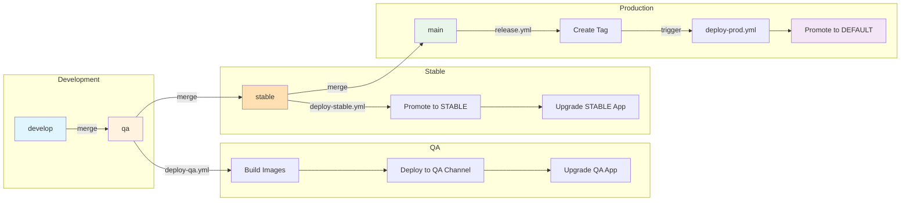
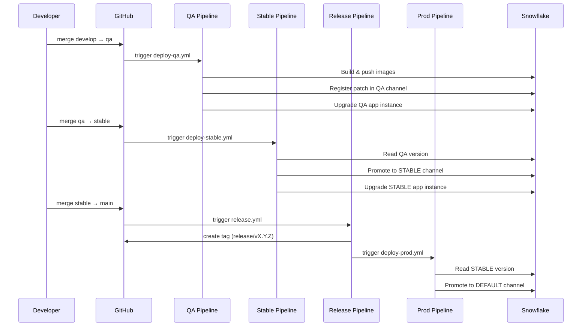

# Automatic Deployment Guide

This guide explains how to set up and use the automatic CI/CD deployment pipeline for the BlendX Marketplace application.

## Branch Flow



### Pipeline Flow



| Branch | Environment | Purpose |
|--------|-------------|---------|
| `develop` | Local | Local development and testing (no CI) |
| `qa` | QA | Builds images, deploys to QA release channel (merge from develop) |
| `stable` | Stable | Promotes QA version to STABLE channel (merge from qa) |
| `main` | Production | Auto-creates release tag, triggers production deploy (merge from stable) |

## Prerequisites

Before setting up automatic deployment, ensure you have:

1. A Snowflake account with ACCOUNTADMIN access (for initial setup)
2. Access to the GitHub repository settings
3. The Snowflake CLI installed locally (`snow`)

## Initial Setup (One-Time)

### Step 1: Generate RSA Key Pair

Generate the RSA keys for JWT authentication:

```bash
mkdir -p keys/pipeline
openssl genrsa 2048 | openssl pkcs8 -topk8 -inform PEM -out keys/pipeline/snowflake_key.p8 -nocrypt
openssl rsa -in keys/pipeline/snowflake_key.p8 -pubout -out keys/pipeline/snowflake_key.pub
```

> **Important**: Keep `snowflake_key.p8` secure. This is your private key and should never be committed to the repository.

### Step 2: Run Provider Setup Script

The setup script creates the CI/CD user, role, and necessary permissions in Snowflake:

```bash
# Ensure you have a connection with ACCOUNTADMIN role configured
./setup/provider-setup.sh
```

The script will:
1. Create database, schema, stage, and image repository
2. Create a service user (`MK_BLENDX_DEPLOY_USER`) with JWT authentication
3. Create a role (`MK_BLENDX_DEPLOY_ROLE`) with necessary permissions
4. Grant permissions on warehouse, database, schema, stage, and image repository
5. Grant permission to create Application Packages
6. Display all GitHub secrets and variables you need to configure

### Step 3: Configure GitHub Secrets and Variables

In your GitHub repository, go to **Settings > Secrets and variables > Actions** and create the following environments: `qa`, `stable`, and `production`.

#### Secrets (sensitive - same for all environments)

These contain sensitive information and must be stored as **secrets**:

| Secret | Description | Example |
|--------|-------------|---------|
| `SNOWFLAKE_ACCOUNT` | Snowflake account identifier | `xy12345.us-east-1` |
| `SNOWFLAKE_HOST` | Snowflake host URL | `xy12345.us-east-1.snowflakecomputing.com` |
| `SNOWFLAKE_PRIVATE_KEY_RAW` | Content of `snowflake_key.p8` | (full PEM content) |

#### Variables (shared across all environments)

These can be stored as **variables** since they are not sensitive:

| Variable | Description | Example |
|----------|-------------|---------|
| `SNOWFLAKE_DEPLOY_USER` | CI/CD user name | `MK_BLENDX_DEPLOY_USER` |
| `SNOWFLAKE_DEPLOY_ROLE` | CI/CD role name | `MK_BLENDX_DEPLOY_ROLE` |
| `SNOWFLAKE_WAREHOUSE` | Warehouse name | `BLENDX_APP_WH` |
| `SNOWFLAKE_DATABASE` | Database name | `BLENDX_APP_DB` |
| `SNOWFLAKE_SCHEMA` | Schema name | `BLENDX_SCHEMA` |
| `SNOWFLAKE_REPO` | Image repository URL | `org-account.registry.snowflakecomputing.com/db/schema/img_repo` |
| `SNOWFLAKE_APP_PACKAGE` | Application package name | `MK_BLENDX_APP_PKG` |
| `SNOWFLAKE_ROLE` | Role for app management | `BLENDX_APP_ROLE` |

#### Variables (environment-specific)

These variables differ per environment:

| Variable | `qa` | `stable` | `production` |
|----------|------|----------|--------------|
| `SNOWFLAKE_APP_INSTANCE` | `BLENDX_APP_INSTANCE_QA` | `BLENDX_APP_INSTANCE_STABLE` | *(not used)* |
| `SNOWFLAKE_COMPUTE_POOL` | `BLENDX_APP_COMPUTE_POOL_QA` | `BLENDX_APP_COMPUTE_POOL_STABLE` | *(not used)* |

> **Note**: The `production` environment only promotes versions to the DEFAULT channel and doesn't manage an app instance directly. Using separate compute pools per environment ensures resource isolation between QA and STABLE.

### Step 4: Run Setup Package Workflow

In GitHub Actions, manually run the **"Setup Package"** workflow. This is a one-time workflow that:
- Builds and pushes Docker images to Snowflake Image Repository
- Creates the Application Package
- Registers the first version (V1)
- Creates the QA release channel

> **Note**: This workflow should only be run once for initial setup. After this, use the regular QA/Stable pipelines.

### Step 5: Create Application Instances

After the Setup Package workflow completes successfully, create the application instances:

```bash
./setup/create-application.sh --all-envs
```

This creates:
- `BLENDX_APP_INSTANCE_QA` - for QA testing
- `BLENDX_APP_INSTANCE_STABLE` - for stable/pre-production testing

The script will:
1. Check prerequisites (version exists in the application package)
2. Create application instances from the deployed package
3. Grant account-level permissions to each application (CREATE COMPUTE POOL, BIND SERVICE ENDPOINT, etc.)

You can also create instances individually:
```bash
./setup/create-application.sh --env qa      # Only QA
./setup/create-application.sh --env stable  # Only STABLE
```

> **Note**: This script requires ACCOUNTADMIN role for granting account-level permissions to the applications.

## Pipelines Overview

| Pipeline | File | Trigger | Purpose |
|----------|------|---------|---------|
| QA Deployment | `deploy-qa.yml` | Push to `qa` (merge from develop) | Build, deploy, and restart QA environment |
| Stable Promotion | `deploy-stable.yml` | Push to `stable` (merge from qa) | Promote QA version to STABLE channel |
| Create Release Tag | `release.yml` | Push to `main` or manual | Auto-create release tag and trigger production deploy |
| Production Release | `deploy-prod.yml` | Called by `release.yml` or manual | Promote STABLE version to production |

## QA Pipeline (deploy-qa.yml)

### Trigger

- **Automatic**: Push to `qa` branch (must be merged from `develop`)
- **Manual**: GitHub Actions workflow dispatch

### Preflight Validation

Before building, the pipeline validates:
- `qa` branch must contain all commits from `develop`
- `qa` must be updated via merge commit from `develop` (no direct commits)

### Steps

1. Validates that `qa` was updated via a merge from `develop`
2. Builds Docker images for backend, frontend, and router (parallel)
3. Pushes images to Snowflake Image Repository
4. Generates `setup.sql` from templates
5. Uploads application files to Snowflake stage
6. Creates the Application Package if it doesn't exist
7. Registers a new patch in the QA release channel
8. Upgrades and restarts the application (if installed)

### Version Strategy

- Version is derived from git tags: `v1.x.x` → `V1`, `v2.x.x` → `V2`
- Each push to `qa` adds a new patch to the current version
- Default version is `V1` if no tags exist

## Stable Pipeline (deploy-stable.yml)

### Trigger

- **Automatic**: Push to `stable` branch (must be merged from `qa`)
- **Manual**: GitHub Actions workflow dispatch

### Preflight Validation

Before promoting, the pipeline validates:
- `stable` branch must contain all commits from `qa`
- `stable` must be updated via merge commit from `qa` (no direct commits)

### Steps

1. Validates that `stable` was updated via a merge from `qa`
2. Reads the latest version and patch from the QA release channel
3. Validates the promotion is monotonic (no regressions)
4. Promotes the QA version to the STABLE release channel
5. Sets the STABLE release directive

## Release Tag Pipeline (release.yml)

### Trigger

- **Automatic**: Push to `main` branch (merge from stable)
- **Manual**: GitHub Actions workflow dispatch with optional version input

### Auto-increment

When triggered automatically (push to main), the tag version is auto-incremented:
- If no `release/*` tags exist: `release/v1.0.0`
- Otherwise: increments patch number (e.g., `release/v1.0.0` → `release/v1.0.1`)

### Output

Creates an annotated tag on `main` and directly triggers the `deploy-prod.yml` workflow via `workflow_dispatch`.

## Production Pipeline (deploy-prod.yml)

### Trigger

- **Automatic**: Called by `release.yml` after creating the tag
- **Manual**: GitHub Actions workflow dispatch with optional version/patch inputs

### Steps

1. Reads the latest version and patch from the STABLE release channel (or uses manual override)
2. Validates the promotion is monotonic (no regressions)
3. Promotes the version to the DEFAULT (production) release channel
4. Sets the DEFAULT release directive

### Manual Override

When triggering manually, you can specify:
- `version`: Version to release (e.g., `V1`)
- `patch`: Patch number to release (e.g., `5`)

If both are specified, they take priority over the STABLE channel version. This allows releasing any specific version in case of emergency or rollback scenarios.

If not specified, values are auto-detected from STABLE channel.

## Release Channels

| Channel | Purpose | Updated by |
|---------|---------|------------|
| `QA` | Testing and development | QA pipeline on every push to `qa` |
| `STABLE` | Pre-production validation | Stable pipeline on every push to `stable` |
| `DEFAULT` | Production (marketplace consumers) | Production pipeline (triggered by `release.yml`) |

> **Note**: Versions in DEFAULT channel require Snowflake security review before they are available to marketplace consumers.

## Typical Workflow

1. Developer creates feature branch from `develop`
2. Developer creates PR to `develop`
3. PR is merged to `develop`
4. When ready for QA: merge `develop` → `qa`
5. QA pipeline triggers → builds images, deploys, restarts service
6. QA testing is performed
7. When QA is approved: merge `qa` → `stable`
8. Stable pipeline triggers → promotes QA version to STABLE channel
9. When ready for release: merge `stable` → `main`
10. Release tag is auto-created (e.g., `release/v1.0.1`)
11. Production pipeline is triggered → promotes STABLE version to DEFAULT channel
12. Submit for Snowflake security review (manual step in Provider Studio)
13. After approval, version is available on Marketplace

## Database Migrations

The application uses Alembic for database schema management. SQLAlchemy models are the source of truth for the database schema.

### How Migrations Work in the Native App

Since Snowflake Native Apps cannot run Python migrations directly, the system converts Alembic migrations to idempotent SQL:

1. **Development**: Developers create/modify SQLAlchemy models and generate Alembic migrations
2. **Build**: `generate_migrations_sql.py` converts migrations to idempotent SQL files
3. **Deployment**: SQL is injected into `setup.sql` via the `{{MIGRATIONS_SQL}}` placeholder
4. **Upgrade**: All SQL uses `IF NOT EXISTS` / `IF EXISTS` clauses, making upgrades safe


### Idempotent Migrations for Upgrades

All generated SQL is idempotent to support incremental upgrades:

```sql
-- Tables: CREATE TABLE IF NOT EXISTS
CREATE TABLE IF NOT EXISTS app_data.my_table (...);

-- Columns: ADD COLUMN IF NOT EXISTS
ALTER TABLE app_data.my_table ADD COLUMN IF NOT EXISTS new_column VARCHAR(255);

-- Version tracking: INSERT only if not exists
INSERT INTO app_data.alembic_version (version_num)
SELECT '002_add_column' WHERE NOT EXISTS (
    SELECT 1 FROM app_data.alembic_version WHERE version_num = '002_add_column'
);
```

This means:
- **New installation**: All tables and columns are created
- **Upgrade**: Only new tables/columns are added, existing data is preserved

### Creating New Migrations

When you need to modify the database schema:

1. **Modify SQLAlchemy models** in `backend/app/database/models/`
2. **Generate migration** from the backend directory:
   ```bash
   cd backend
   alembic revision --autogenerate -m "description_of_change"
   ```
3. **Review the generated file** in `backend/alembic/versions/` and adjust if needed
4. **Regenerate SQL**:
   ```bash
   python scripts/generate_migrations_sql.py
   ```
5. **Commit** the model changes, migration file, AND generated SQL files

### Generated Files Structure

```
scripts/sql/
├── migrations/                          # Individual migration files
│   ├── 001_initial_schema.sql          # First migration
│   ├── 002_add_new_column.sql          # Second migration
│   └── ...
├── migrations.sql                       # Combined file (all migrations)
└── migrations_manifest.json             # Metadata about migrations
```

### Local Development Commands

Run these commands from the `backend/` directory:

| Command | Description |
|---------|-------------|
| `alembic revision --autogenerate -m "desc"` | Create new migration from model changes |
| `alembic upgrade head` | Apply all pending migrations (local dev) |
| `alembic history` | View migration history |
| `alembic downgrade -1` | Rollback last migration (local dev) |
| `alembic current` | Show current migration version |

From the project root:

| Command | Description |
|---------|-------------|
| `python scripts/generate_migrations_sql.py` | Regenerate SQL from Alembic migrations |

### Migration Files Reference

| File/Directory | Purpose |
|----------------|---------|
| `backend/alembic/` | Alembic configuration directory |
| `backend/alembic/versions/` | Migration scripts (Python) |
| `backend/app/database/models/` | SQLAlchemy models (source of truth) |
| `scripts/generate_migrations_sql.py` | Converts Alembic migrations to SQL |
| `scripts/sql/migrations/` | Individual SQL migration files |
| `scripts/sql/migrations.sql` | Combined SQL (auto-generated) |
| `scripts/sql/migrations_manifest.json` | Migration metadata |
| `templates/setup_template.sql` | Template with `{{MIGRATIONS_SQL}}` placeholder |

### CI/CD Integration

The migration SQL is automatically generated during the QA deployment pipeline:

1. `generate-app-files.py` calls `generate_migrations_sql.py`
2. Individual `.sql` files are generated in `scripts/sql/migrations/`
3. Combined `migrations.sql` is injected into `setup.sql`
4. When installed/upgraded, idempotent SQL ensures correct schema state

### Pipeline Validation

The QA pipeline validates that all Alembic migrations have corresponding SQL files before deploying. If any migration is missing its SQL file, the pipeline will fail with an error indicating which files need to be generated.

This validation runs in the `validate` job of `deploy-qa.yml` and checks:
- Every `.py` file in `backend/alembic/versions/` has a corresponding `.sql` file in `scripts/sql/migrations/`

If validation fails, run:
```bash
python scripts/generate_migrations_sql.py
```

Then commit the generated SQL files before pushing again.

> **Note**: The `alembic_version` table tracks which migrations have been applied. Use `CALL app_data.get_migration_status()` to check the current state.

## Considerations

- **Private Key Security**: Never commit `snowflake_key.p8` to the repository
- **Environment Secrets**: Use separate GitHub environments (`qa`, `production`) with different secrets
- **Least Privilege**: CI/CD role only has permissions it needs
- **Version Limits**: Snowflake allows max 2 versions not in any release channel (pipeline auto-cleans orphans)
- **Security Review**: Versions in DEFAULT channel require Snowflake approval before marketplace availability

## Files Reference

| File | Purpose |
|------|---------|
| `.github/workflows/deploy-qa.yml` | QA deployment workflow |
| `.github/workflows/deploy-stable.yml` | Stable promotion workflow (QA → STABLE) |
| `.github/workflows/release.yml` | Auto-creates release tags and triggers production deploy |
| `.github/workflows/deploy-prod.yml` | Production promotion workflow (STABLE → DEFAULT) |
| `.github/workflows/setup-package.yml` | Initial package setup (first deploy) |
| `setup/config.sh` | Shared configuration for all setup scripts |
| `setup/provider-setup.sh` | Initial Snowflake setup (user, role, permissions) |
| `setup/create-application.sh` | Create application instances (QA, STABLE) |
