# Automatic Deployment Guide

This guide explains how to set up and use the automatic CI/CD deployment pipeline for the BlendX Marketplace application.


## Branch Flow

### Image Tagging Strategy

Docker images are **built only once** in the `qa` pipeline and **never rebuilt** for `stable` or `main`.

**Tagging rules:**

- **Primary tag (immutable)**:  
  - `sha-<git_commit_sha>`  
  - Used as the real source of truth and always referenced by the application package.
- **Environment alias tag**:  
  - `qa`  
  - Updated on every QA build to point to the latest QA-tested image.

**What we intentionally do NOT do:**

- ❌ No image builds on `develop`
- ❌ No `stable` or `prod` image tags
- ❌ No retagging on `stable → main` merges

**Why this matters:**

- Guarantees **artifact immutability** across QA → STABLE → PROD
- Ensures production runs **the exact same image** validated in QA
- Avoids ambiguity caused by environment-based tags drifting over time

Promotion between environments is done exclusively via **Snowflake release channels**, not Docker tags.


### Pipeline Flow

```mermaid
sequenceDiagram
    participant Dev as Developer
    participant GH as GitHub
    participant QA as QA Pipeline
    participant Stb as Stable Pipeline
    participant Rel as Release Pipeline
    participant Prod as Prod Pipeline
    participant Reg as Shared Registry
    participant SF as Snowflake

    Dev->>GH: merge develop → qa
    GH->>QA: trigger deploy-qa.yml
    QA->>Reg: Build & push images (sha + qa tags)
    QA->>SF: Register patch in QA channel
    QA->>SF: Upgrade QA app instance

    Dev->>GH: merge qa → stable
    GH->>Stb: trigger deploy-stable.yml
    Note over Stb,Reg: No rebuild - reuses images from registry
    Stb->>SF: Read QA version
    Stb->>SF: Promote to STABLE channel
    Stb->>SF: Upgrade STABLE app instance

    Dev->>GH: merge stable → main
    GH->>Rel: trigger release.yml
    Rel->>GH: create tag (release/vX.Y.Z)
    Rel->>Prod: trigger deploy-prod.yml
    Note over Prod,Reg: No rebuild - reuses images from registry
    Prod->>SF: Read STABLE version
    Prod->>SF: Promote to DEFAULT channel
```



| Branch | Environment | Purpose |
|--------|-------------|---------|
| `develop` | Local | Local development and testing (no CI) |
| `qa` | QA | Builds images, deploys to QA release channel (merge from develop) |
| `stable` | Stable | Promotes QA version to STABLE channel (merge from qa) |
| `main` | Production | Auto-creates release tag, triggers production deploy (merge from stable) |

## Prerequisites

Before setting up automatic deployment, ensure you have:

1. A Snowflake account with ACCOUNTADMIN access (for initial setup)
2. Access to the GitHub repository settings
3. The Snowflake CLI installed locally (`snow`)

## Initial Setup (One-Time)

### Step 1: Generate RSA Key Pair

Generate the RSA keys for JWT authentication:

```bash
mkdir -p keys/pipeline
openssl genrsa 2048 | openssl pkcs8 -topk8 -inform PEM -out keys/pipeline/snowflake_key.p8 -nocrypt
openssl rsa -in keys/pipeline/snowflake_key.p8 -pubout -out keys/pipeline/snowflake_key.pub
```

> **Important**: Keep `snowflake_key.p8` secure. This is your private key and should never be committed to the repository.

### Step 2: Run Provider Setup Script

The setup script creates the CI/CD user, role, and necessary permissions in Snowflake:

```bash
# Ensure you have a connection with ACCOUNTADMIN role configured
./setup/provider-setup.sh
```

The script will:
1. Create database, schema, stage, and image repository
2. Create a service user (`MK_BLENDX_DEPLOY_USER`) with JWT authentication
3. Create a role (`MK_BLENDX_DEPLOY_ROLE`) with necessary permissions
4. Grant permissions on warehouse, database, schema, stage, and image repository
5. Grant permission to create Application Packages
6. Display all GitHub secrets and variables you need to configure

### Step 3: Configure GitHub Secrets and Variables

In your GitHub repository, go to **Settings > Secrets and variables > Actions** and create the following environments: `qa`, `stable`, and `production`.

#### Secrets (sensitive - same for all environments)

These contain sensitive information and must be stored as **secrets**:

| Secret | Description | Example |
|--------|-------------|---------|
| `SNOWFLAKE_ACCOUNT` | Snowflake account identifier | `xy12345.us-east-1` |
| `SNOWFLAKE_HOST` | Snowflake host URL | `xy12345.us-east-1.snowflakecomputing.com` |
| `SNOWFLAKE_PRIVATE_KEY_RAW` | Content of `snowflake_key.p8` | (full PEM content) |

#### Variables (shared across all environments)

These can be stored as **variables** since they are not sensitive:

| Variable | Description | Example |
|----------|-------------|---------|
| `SNOWFLAKE_DEPLOY_USER` | CI/CD user name | `MK_BLENDX_DEPLOY_USER` |
| `SNOWFLAKE_DEPLOY_ROLE` | CI/CD role name | `MK_BLENDX_DEPLOY_ROLE` |
| `SNOWFLAKE_WAREHOUSE` | Warehouse name | `BLENDX_APP_WH` |
| `SNOWFLAKE_DATABASE` | Database name (for stage and files) | `BLENDX_APP_DB` |
| `SNOWFLAKE_SCHEMA` | Schema name | `BLENDX_SCHEMA` |
| `SNOWFLAKE_REPO` | Image repository URL | `org-account.registry.snowflakecomputing.com/db/schema/images` |
| `SNOWFLAKE_APP_PACKAGE` | Application package name | `MK_BLENDX_APP_PKG` |
| `SNOWFLAKE_ROLE` | Role for app management | `BLENDX_APP_ROLE` |

#### Variables (environment-specific)

These variables differ per environment:

| Variable | `qa` | `stable` | `production` |
|----------|------|----------|--------------|
| `SNOWFLAKE_APP_INSTANCE` | `BLENDX_APP_INSTANCE_QA` | `BLENDX_APP_INSTANCE_STABLE` | *(not used)* |
| `SNOWFLAKE_COMPUTE_POOL` | `BLENDX_APP_COMPUTE_POOL_QA` | `BLENDX_APP_COMPUTE_POOL_STABLE` | *(not used)* |

> **Note**: The `production` environment only promotes versions to the DEFAULT channel and doesn't manage an app instance directly. Using separate compute pools per environment ensures resource isolation between QA and STABLE.

### Shared Resources Architecture

The application uses a **single shared image registry and warehouse** across all environments, while keeping data isolated per environment:

| Resource | Scope | Notes |
|----------|-------|-------|
| **Image Registry** | Shared | `/BLENDX_APP_DB/BLENDX_SCHEMA/IMG_REPO/` - Docker images are immutable and reused across QA → STABLE → PROD |
| **Warehouse** | Shared | `BLENDX_APP_WH` - Used for query execution by all environments |
| **Application Package** | Shared | Single package with multiple release channels (QA, STABLE, DEFAULT) |
| **Database/Schema** | Per environment | Data isolation - each environment has its own database |
| **Compute Pool** | Per environment | Resource isolation - each environment runs on its own compute |
| **App Instance** | Per environment | Separate app instances for QA and STABLE testing |

This architecture allows versions to be promoted between environments (QA → STABLE → PROD) without rebuilding images or regenerating application files, since the same artifacts are used across all environments.

### Step 4: Run Setup Package Workflow

In GitHub Actions, manually run the **"Setup Package"** workflow. This is a one-time workflow that:
- Builds and pushes Docker images to Snowflake Image Repository
- Creates the Application Package
- Registers the first version (V1)
- Creates the QA release channel

> **⚠️ Important: Setup Package vs Deploy QA**
>
> | Scenario | Workflow to Use |
> |----------|-----------------|
> | **First time** - Package doesn't exist | Run **Setup Package** (manual trigger) |
> | **Updates** - Package already exists | Merge to `qa` branch → **Deploy QA** runs automatically |
>
> **Setup Package** uses `REGISTER VERSION` which fails if the version already exists.
> **Deploy QA** uses `ADD PATCH FOR VERSION` which creates incremental patches.
>
> If you accidentally run Setup Package when the package already exists, the workflow will fail at the "Register first version" step. In that case, just use Deploy QA instead by merging your changes to the `qa` branch.

### Step 5: Create Application Instances

After the Setup Package workflow completes successfully, create the application instances:

```bash
./setup/create-application.sh --all-envs
```

This creates:
- `BLENDX_APP_INSTANCE_QA` - for QA testing
- `BLENDX_APP_INSTANCE_STABLE` - for stable/pre-production testing

The script will:
1. Check prerequisites (version exists in the application package)
2. Create application instances from the deployed package
3. Grant account-level permissions to each application (CREATE COMPUTE POOL, BIND SERVICE ENDPOINT, etc.)

You can also create instances individually:
```bash
./setup/create-application.sh --env qa      # Only QA
./setup/create-application.sh --env stable  # Only STABLE
```

> **Note**: This script requires ACCOUNTADMIN role for granting account-level permissions to the applications.

### Step 6: Activate and Configure the Application

After creating the application instances, you need to activate and configure them through the Snowflake interface:

1. **Open Snowflake UI**: Go to **Data Products > Apps > Installed Apps**
2. **Select the application**: Click on `BLENDX_APP_INSTANCE_QA` (or the corresponding instance)
3. **Activate the app and grant permissions**: The app will request the necessary permissions. Click **Grant** for each required permission
4. **Approve External Access**: The application requires external access to connect to external APIs (e.g., Serper for web search):
   - Go to the **Security** tab in the application
   - You will see pending requests for each configured External Access Integration
   - Review each external access specification and click **Approve** to allow the connection
   - By default, the application comes pre-configured with Serper API access (`google.serper.dev`)

   > **Note**: External Access Integrations are defined using `ALTER APPLICATION SET SPECIFICATION` and require explicit consumer approval as per [Snowflake documentation](https://docs.snowflake.com/en/developer-guide/native-apps/requesting-app-specs-eai). See the [External Access Integration Management](#external-access-integration-management) section for details on adding custom integrations.

5. **Configure the secret** (if required by the app):
   - Switch to role ACCOUNTADMIN
   - Go to the **Connections** tab
   - Press Configure and create or select an existing secret for API credentials
   - The secret should contain the necessary authentication tokens

6. **Activate the app**: Click the **Activate** button to start the application services
7. **Verify activation**:
   - Wait for the status to show "Active"
   - Check that the service endpoint is accessible
8. **Start the application**: Once the app is active, execute the start procedure with the environment prefix:
   ```sql
   USE ROLE BLENDX_APP_ROLE;
   CALL BLENDX_APP_INSTANCE_QA.APP_PUBLIC.start_application_WITH_PREFIX('QA');
   ```
   For the STABLE environment:
   ```sql
   CALL BLENDX_APP_INSTANCE_STABLE.APP_PUBLIC.start_application_WITH_PREFIX('STABLE');
   ```
   The procedure automatically creates all resources with the environment prefix:
   - Compute pool: `{PREFIX}_BLENDX_APP_COMPUTE_POOL`
   - Warehouse: `{PREFIX}_BLENDX_APP_WH`
   - External access integrations: `{PREFIX}_BLENDX_{NAME}_EAI` (one per configured EAI)

Repeat these steps for each environment (QA, STABLE) as needed.

> **Note**: The `production` environment does not have an application instance. It only promotes versions to the DEFAULT channel for marketplace listing.

> **Note**: The first activation may take several minutes while Snowflake provisions the compute pool and starts the services.

## Pipelines Overview

| Pipeline | File | Trigger | Purpose |
|----------|------|---------|---------|
| QA Deployment | `deploy-qa.yml` | Push to `qa` (merge from develop) | Build, deploy, and restart QA environment |
| Stable Promotion | `deploy-stable.yml` | Push to `stable` (merge from qa) | Promote QA version to STABLE channel |
| Create Release Tag | `release.yml` | Push to `main` or manual | Auto-create release tag and trigger production deploy |
| Production Release | `deploy-prod.yml` | Called by `release.yml` or manual | Promote STABLE version to production |

## QA Pipeline (deploy-qa.yml)

### Trigger

- **Automatic**: Push to `qa` branch (must be merged from `develop`)
- **Manual**: GitHub Actions workflow dispatch

### Preflight Validation

Before building, the pipeline validates:
- `qa` branch must contain all commits from `develop`
- `qa` must be updated via merge commit from `develop` (no direct commits)

### Steps

1. Validates that `qa` was updated via a merge from `develop`
2. Builds Docker images for backend, frontend, and router (parallel)
3. Pushes images to Snowflake Image Repository (shared registry)
4. Generates application files from templates (only `IMAGE_TAG` is dynamic)
5. Uploads application files to Snowflake stage
6. Creates the Application Package if it doesn't exist
7. Registers a new patch in the QA release channel
8. Upgrades and restarts the application (if installed)

> **📝 Note: Running Deploy QA before Application Instance exists**
>
> If you run Deploy QA before creating the Application Instance (Step 5 in Initial Setup), the pipeline will:
> - ✅ Build and push images successfully
> - ✅ Upload files to stage successfully
> - ✅ Create the new patch successfully
> - ❌ Fail at the "Upgrade Application" step (application doesn't exist)
>
> **This is expected behavior.** The patch is still created and available. After the pipeline fails, run `./setup/create-application.sh --all-envs` to create the application instances. Subsequent Deploy QA runs will work normally.

### Version Strategy

- Version is derived from git tags: `v1.x.x` → `V1`, `v2.x.x` → `V2`
- Each push to `qa` adds a new patch to the current version
- Default version is `V1` if no tags exist

## Stable Pipeline (deploy-stable.yml)

### Trigger

- **Automatic**: Push to `stable` branch (must be merged from `qa`)
- **Manual**: GitHub Actions workflow dispatch

### Preflight Validation

Before promoting, the pipeline validates:
- `stable` branch must contain all commits from `qa`
- `stable` must be updated via merge commit from `qa` (no direct commits)

### Steps

1. Validates that `stable` was updated via a merge from `qa`
2. Reads the latest version and patch from the QA release channel
3. Validates the promotion is monotonic (no regressions)
4. Promotes the QA version to the STABLE release channel
5. Sets the STABLE release directive

## Release Tag Pipeline (release.yml)

### Trigger

- **Automatic**: Push to `main` branch (merge from stable)
- **Manual**: GitHub Actions workflow dispatch with optional version input

### Auto-increment

When triggered automatically (push to main), the tag version is auto-incremented:
- If no `release/*` tags exist: `release/v1.0.0`
- Otherwise: increments patch number (e.g., `release/v1.0.0` → `release/v1.0.1`)

### Output

Creates an annotated tag on `main` and directly triggers the `deploy-prod.yml` workflow via `workflow_dispatch`.

## Production Pipeline (deploy-prod.yml)

### Trigger

- **Automatic**: Called by `release.yml` after creating the tag
- **Manual**: GitHub Actions workflow dispatch with optional version/patch inputs

### Steps

1. Reads the latest version and patch from the STABLE release channel (or uses manual override)
2. Validates the promotion is monotonic (no regressions)
3. Promotes the version to the DEFAULT (production) release channel
4. Sets the DEFAULT release directive

### Manual Override

When triggering manually, you can specify:
- `version`: Version to release (e.g., `V1`)
- `patch`: Patch number to release (e.g., `5`)

If both are specified, they take priority over the STABLE channel version. This allows releasing any specific version in case of emergency or rollback scenarios.

If not specified, values are auto-detected from STABLE channel.

## Release Channels

| Channel | Purpose | Updated by |
|---------|---------|------------|
| `QA` | Testing and development | QA pipeline on every push to `qa` |
| `STABLE` | Pre-production validation | Stable pipeline on every push to `stable` |
| `DEFAULT` | Production (marketplace consumers) | Production pipeline (triggered by `release.yml`) |

> **Note**: Versions in DEFAULT channel require Snowflake security review before they are available to marketplace consumers.

## Typical Workflow

1. Developer creates feature branch from `develop`
2. Developer creates PR to `develop`
3. PR is merged to `develop`
4. When ready for QA: merge `develop` → `qa`
5. QA pipeline triggers → builds images, deploys, restarts service
6. QA testing is performed
7. When QA is approved: merge `qa` → `stable`
8. Stable pipeline triggers → promotes QA version to STABLE channel
9. When ready for release: merge `stable` → `main`
10. Release tag is auto-created (e.g., `release/v1.0.1`)
11. Production pipeline is triggered → promotes STABLE version to DEFAULT channel
12. Submit for Snowflake security review (manual step in Provider Studio)
13. After approval, version is available on Marketplace

## Database Migrations

The application uses Alembic for database schema management. SQLAlchemy models are the source of truth for the database schema.

### How Migrations Work in the Native App

Since Snowflake Native Apps cannot run Python migrations directly, the system converts Alembic migrations to idempotent SQL:

1. **Development**: Developers create/modify SQLAlchemy models and generate Alembic migrations
2. **Build**: `./scripts/generate/generate_migrations_sql.py` converts migrations to idempotent SQL files
3. **Deployment**: SQL is injected into `setup.sql` via the `{{MIGRATIONS_SQL}}` placeholder
4. **Upgrade**: All SQL uses `IF NOT EXISTS` / `IF EXISTS` clauses, making upgrades safe


- **New installation**: All tables and columns are created
- **Upgrade**: Only new tables/columns are added, existing data is preserved

### Creating New Migrations

When you need to modify the database schema:

1. **Modify SQLAlchemy models** in `backend/app/database/models/`
2. **Generate migration** from the backend directory:
   ```bash
   cd backend
   alembic revision --autogenerate -m "description_of_change"
   ```
3. **Review the generated file** in `backend/alembic/versions/` and adjust if needed
4. **Regenerate SQL**:
   ```bash
   python scripts/generate/generate_migrations_sql.py
   ```
5. **Commit** the model changes, migration file, AND generated SQL files

### Generated Files Structure

```
scripts/generated/
├── migrations/                          # Migration files (committed)
│   ├── sql/                             # Individual migration files
│   │   ├── 001_initial_schema.sql
│   │   ├── 002_add_new_column.sql
│   │   └── ...
│   ├── migrations.sql                   # Combined file (all migrations)
│   └── migrations_manifest.json         # Metadata about migrations
└── local_*.sql                          # Local dev files (not committed)
```

### Local Development Commands

Run these commands from the `backend/` directory:

| Command | Description |
|---------|-------------|
| `alembic revision --autogenerate -m "desc"` | Create new migration from model changes |

From the project root:

| Command | Description |
|---------|-------------|
| `python scripts/generate/generate_migrations_sql.py` | Regenerate SQL from Alembic migrations (for Native App deployment) |
| `python scripts/generate/generate_migrations_sql.py --schema <SCHEMA> --database <DB> --role <ROLE>` | Generate local_migrations.sql for local Snowflake development |

### Generating Local Migrations SQL

For local Snowflake development, you can generate a `local_migrations.sql` file that can be executed directly against your local Snowflake database. This file includes the database, schema, and role context needed to run the migrations.

```bash
python scripts/generate/generate_migrations_sql.py \
  --schema APP_DATA \
  --database BLENDX_APP_DEV_DB \
  --role BLENDX_APP_DEV_ROLE
```

This generates `scripts/generated/local_migrations.sql` which you can execute with:

```bash
snow sql -f scripts/generated/local_migrations.sql --connection your_connection
```

The local migrations file includes:
- `USE ROLE`, `USE DATABASE`, and `USE SCHEMA` statements
- Alembic version tracking table creation
- All migrations with `IF NOT EXISTS` / `IF EXISTS` clauses for idempotency
- Version tracking inserts to mark migrations as applied

> **Note**: The `local_migrations.sql` file is not committed to the repository as it contains environment-specific configuration.

### Migration Files Reference

| File/Directory | Purpose |
|----------------|---------|
| `backend/alembic/` | Alembic configuration directory |
| `backend/alembic/versions/` | Migration scripts (Python) |
| `backend/app/database/models/` | SQLAlchemy models (source of truth) |
| `scripts/generate/generate_migrations_sql.py` | Converts Alembic migrations to SQL |
| `scripts/generated/migrations/sql/` | Individual SQL migration files (auto-generated) |
| `scripts/generated/migrations/migrations.sql` | Combined SQL (auto-generated) |
| `scripts/generated/migrations/migrations_manifest.json` | Migration metadata (auto-generated) |
| `templates/setup_template.sql` | Template with `{{MIGRATIONS_SQL}}` placeholder |

### CI/CD Integration

The migration SQL is automatically generated during the QA deployment pipeline:

1. `generate-app-files.py` calls `generate_migrations_sql.py`
2. Individual `.sql` files are generated in `scripts/generated/migrations/sql/`
3. Combined `migrations.sql` is injected into `setup.sql`
4. When installed/upgraded, idempotent SQL ensures correct schema state

### Pipeline Validation

The QA pipeline validates that all Alembic migrations have corresponding SQL files before deploying. If any migration is missing its SQL file, the pipeline will fail with an error indicating which files need to be generated.

This validation runs in the `validate` job of `deploy-qa.yml` and checks:
- Every `.py` file in `backend/alembic/versions/` has a corresponding `.sql` file in `scripts/generated/migrations/sql/`

If validation fails, run:
```bash
python scripts/generate/generate_migrations_sql.py
```

Then commit the generated SQL files before pushing again.

> **Note**: The `alembic_version` table tracks which migrations have been applied. Use `CALL app_data.get_migration_status()` to check the current state.

## External Access Integration Management

The application supports dynamic External Access Integration (EAI) management, allowing you to configure connections to external APIs without modifying the code.

### Overview

External Access Integrations allow the application to make outbound connections to external services (APIs). Each EAI consists of:
- **Network Rule**: Defines which hosts are allowed for egress traffic
- **External Access Integration**: Associates the network rule with the application
- **Application Specification**: Describes the EAI for consumer approval in Snowflake UI

### Default Configuration

By default, the application comes pre-configured with Serper API access for web search capabilities:

| Name | Label | Host | Purpose |
|------|-------|------|---------|
| `SERPER` | Connection to Serper API | `google.serper.dev` | Web search functionality |

### Managing External Access Configurations

EAI configurations are stored in the `app_data.external_access_configs` table and managed through SQL procedures.

#### List Configured EAIs

```sql
CALL app_public.list_external_access();
```

Returns a table with all configured EAIs: `name`, `label`, `description`, `host_ports`, `enabled`.

#### Add a New EAI Configuration

```sql
CALL app_public.add_external_access(
    'OPENAI',                           -- name (unique identifier, stored as uppercase)
    'Connection to OpenAI API',         -- label (shown in Snowflake UI)
    'Access to OpenAI for LLM',         -- description
    'api.openai.com'                    -- host_ports (comma-separated for multiple hosts)
);
```

Example with multiple hosts:
```sql
CALL app_public.add_external_access(
    'AWS_SERVICES',
    'Connection to AWS Services',
    'Access to S3 and Lambda',
    's3.amazonaws.com,lambda.us-east-1.amazonaws.com'
);
```

#### Remove an EAI Configuration

```sql
CALL app_public.remove_external_access('OPENAI');
```

> **Note**: This only removes the configuration from the table. To remove the actual Snowflake resources, use `drop_single_external_access`.

#### Enable/Disable an EAI

```sql
-- Disable
CALL app_public.toggle_external_access('SERPER', FALSE);

-- Enable
CALL app_public.toggle_external_access('SERPER', TRUE);
```

Disabled EAIs will not be created when starting the application.

### Creating and Dropping EAIs in Snowflake

After adding a configuration, you need to create the actual Snowflake resources.

#### Create a Single EAI

```sql
-- Without environment prefix
CALL app_public.create_single_external_access('', 'OPENAI');

-- With environment prefix (e.g., QA)
CALL app_public.create_single_external_access('QA', 'OPENAI');
```

This creates:
- Network rule: `app_public.{PREFIX}_BLENDX_OPENAI_NETWORK_RULE`
- External access integration: `{PREFIX}_BLENDX_OPENAI_EAI`
- Application specification for consumer approval

#### Drop a Single EAI

```sql
CALL app_public.drop_single_external_access('QA', 'OPENAI');
```

### Automatic EAI Management

When using `start_application()` or `start_application_WITH_PREFIX()`, all **enabled** EAI configurations are automatically created and attached to the service.

```sql
-- Creates all enabled EAIs and starts the service
CALL app_public.start_application_WITH_PREFIX('QA');
```

Similarly, `destroy_app()` automatically drops all EAIs configured in the table.

### Important Considerations

1. **Consumer Approval Required**: Each EAI requires explicit approval from the consumer in the Snowflake UI (Security tab). New EAIs will appear as pending requests.

2. **Service Restart Required**: To use newly created EAIs, the service must be recreated with the new `EXTERNAL_ACCESS_INTEGRATIONS` list. This typically means:
   ```sql
   CALL app_public.destroy_app_WITH_PREFIX('QA');
   CALL app_public.start_application_WITH_PREFIX('QA');
   ```

3. **Naming Convention**: EAI names are automatically converted to uppercase and follow this pattern:
   - Without prefix: `BLENDX_{NAME}_EAI`
   - With prefix: `{PREFIX}_BLENDX_{NAME}_EAI`

4. **Network Rules**: Each EAI gets its own network rule following the same naming pattern with `_NETWORK_RULE` suffix.

### Example Workflow: Adding OpenAI Integration

```sql
-- 1. Add configuration
CALL app_public.add_external_access(
    'OPENAI',
    'Connection to OpenAI API',
    'Access to OpenAI GPT models for LLM capabilities',
    'api.openai.com'
);

-- 2. Verify configuration
CALL app_public.list_external_access();

-- 3. Restart the application to apply changes
CALL app_public.destroy_app_WITH_PREFIX('QA');
CALL app_public.start_application_WITH_PREFIX('QA');

-- 4. Approve the new EAI in Snowflake UI (Security tab)

-- 5. Configure secrets for the new API (Connections tab)
```

## Considerations

- **Private Key Security**: Never commit `snowflake_key.p8` to the repository
- **Environment Secrets**: Use separate GitHub environments (`qa`, `production`) with different secrets
- **Least Privilege**: CI/CD role only has permissions it needs
- **Version Limits**: Snowflake allows max 2 versions not in any release channel (pipeline auto-cleans orphans)
- **Security Review**: Versions in DEFAULT channel require Snowflake approval before marketplace availability

## Files Reference

| File | Purpose |
|------|---------|
| `.github/workflows/deploy-qa.yml` | QA deployment workflow |
| `.github/workflows/deploy-stable.yml` | Stable promotion workflow (QA → STABLE) |
| `.github/workflows/release.yml` | Auto-creates release tags and triggers production deploy |
| `.github/workflows/deploy-prod.yml` | Production promotion workflow (STABLE → DEFAULT) |
| `.github/workflows/setup-package.yml` | Initial package setup (first deploy) |
| `setup/config.sh` | Shared configuration for all setup scripts |
| `setup/provider-setup.sh` | Initial Snowflake setup (user, role, permissions) |
| `setup/create-application.sh` | Create application instances (QA, STABLE) |
