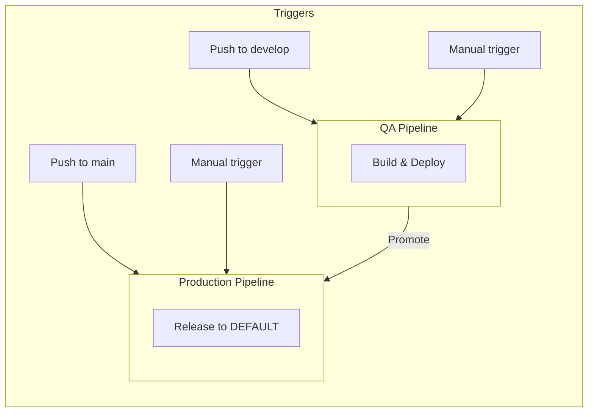
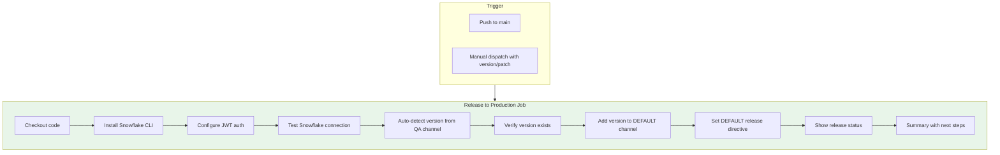
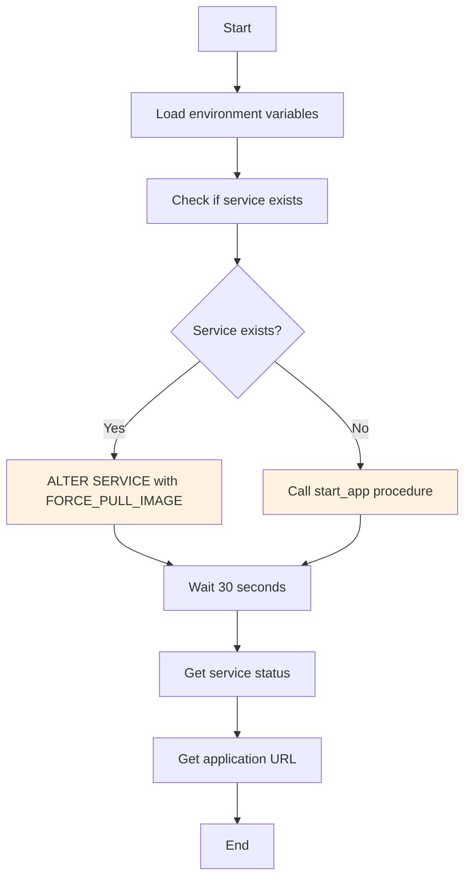
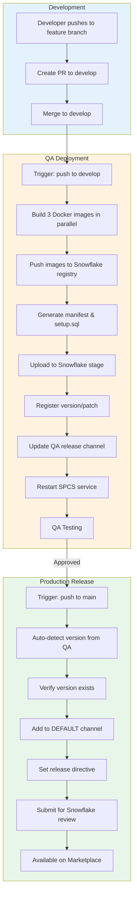
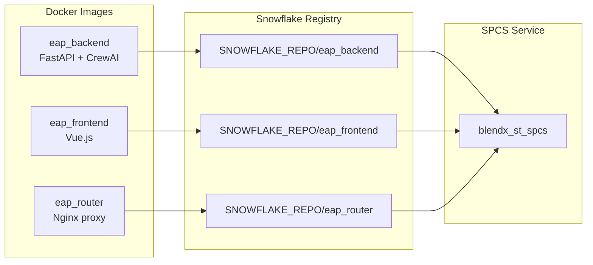
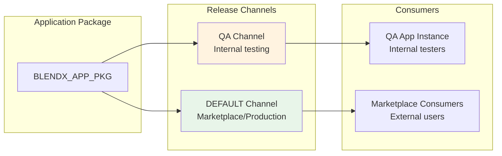

# Pipeline Diagrams

## Overview

```mermaid
flowchart LR
    subgraph Triggers
        A[Push to develop] --> QA
        B[Push to main] --> PROD
        C[Manual trigger] --> QA
        D[Manual trigger] --> PROD
    end

    subgraph QA[QA Pipeline]
        QA1[Build & Deploy]
    end

    subgraph PROD[Production Pipeline]
        PROD1[Release to DEFAULT]
    end

    QA --> |Promote| PROD
```

## QA Pipeline

```mermaid
flowchart TB
    subgraph trigger[Trigger]
        T1[Push to develop]
        T2[Manual dispatch]
    end

    subgraph parallel[Parallel Build Jobs]
        direction TB

        subgraph backend[build-backend]
            B1[Checkout code]
            B2[Setup Docker Buildx]
            B3[Install Snowflake CLI]
            B4[Configure JWT auth]
            B5[Login to Snowflake registry]
            B6[Build & push backend image]
            B1 --> B2 --> B3 --> B4 --> B5 --> B6
        end

        subgraph frontend[build-frontend]
            F1[Checkout code]
            F2[Setup Docker Buildx]
            F3[Install Snowflake CLI]
            F4[Configure JWT auth]
            F5[Login to Snowflake registry]
            F6[Build & push frontend image]
            F1 --> F2 --> F3 --> F4 --> F5 --> F6
        end

        subgraph router[build-router]
            R1[Checkout code]
            R2[Setup Docker Buildx]
            R3[Install Snowflake CLI]
            R4[Configure JWT auth]
            R5[Login to Snowflake registry]
            R6[Build & push router image]
            R1 --> R2 --> R3 --> R4 --> R5 --> R6
        end
    end

    subgraph deploy[Deploy Job]
        D1[Checkout code]
        D2[Determine version from git tag]
        D3[Install & configure Snowflake CLI]
        D4[Generate manifest.yml]
        D5[Generate setup.sql]
        D6[Upload files to Snowflake stage]
        D7[Create Application Package]
        D8[Clean up old versions]
        D9[Register version or add patch]
        D10[Get latest patch number]
        D11[Update QA release channel]
        D12{App exists?}
        D13[Upgrade application]
        D14[Run restart.sh]
        D15[Skip restart]
        D16[Wait 60s for service]
        D17[Get application URL]
        D18[Show summary]

        D1 --> D2 --> D3 --> D4 --> D5 --> D6
        D6 --> D7 --> D8 --> D9 --> D10 --> D11
        D11 --> D12
        D12 -->|Yes| D13 --> D14 --> D16
        D12 -->|No| D15
        D16 --> D17 --> D18
        D15 --> D18
    end

    trigger --> parallel
    parallel --> deploy

    style parallel fill:#e1f5fe
    style deploy fill:#f3e5f5
```

## Production Pipeline

```mermaid
flowchart TB
    subgraph trigger[Trigger]
        T1[Push to main]
        T2[Manual dispatch with version/patch]
    end

    subgraph release[Release to Production Job]
        P1[Checkout code]
        P2[Install Snowflake CLI]
        P3[Configure JWT auth]
        P4[Test Snowflake connection]
        P5[Auto-detect version from QA channel]
        P6[Verify version exists]
        P7[Add version to DEFAULT channel]
        P8[Set DEFAULT release directive]
        P9[Show release status]
        P10[Summary with next steps]

        P1 --> P2 --> P3 --> P4 --> P5 --> P6
        P6 --> P7 --> P8 --> P9 --> P10
    end

    trigger --> release

    style release fill:#e8f5e9
```

## Restart Script

```mermaid
flowchart TB
    R1[Start]
    R2[Load environment variables]
    R3[Check if service exists]
    R4{Service exists?}
    R5[ALTER SERVICE with FORCE_PULL_IMAGE]
    R6[Call start_app procedure]
    R7[Wait 30 seconds]
    R8[Get service status]
    R9[Get application URL]
    R10[End]

    R1 --> R2 --> R3 --> R4
    R4 -->|Yes| R5 --> R7
    R4 -->|No| R6 --> R7
    R7 --> R8 --> R9 --> R10

    style R5 fill:#fff3e0
    style R6 fill:#fff3e0
```

## Complete Flow: Development to Production

```mermaid
flowchart TB
    subgraph dev[Development]
        DEV1[Developer pushes to feature branch]
        DEV2[Create PR to develop]
        DEV3[Merge to develop]
    end

    subgraph qa[QA Deployment]
        QA1[Trigger: push to develop]
        QA2[Build 3 Docker images in parallel]
        QA3[Push images to Snowflake registry]
        QA4[Generate manifest & setup.sql]
        QA5[Upload to Snowflake stage]
        QA6[Register version/patch]
        QA7[Update QA release channel]
        QA8[Restart SPCS service]
        QA9[QA Testing]
    end

    subgraph prod[Production Release]
        PROD1[Trigger: push to main]
        PROD2[Auto-detect version from QA]
        PROD3[Verify version exists]
        PROD4[Add to DEFAULT channel]
        PROD5[Set release directive]
        PROD6[Submit for Snowflake review]
        PROD7[Available on Marketplace]
    end

    DEV1 --> DEV2 --> DEV3
    DEV3 --> QA1
    QA1 --> QA2 --> QA3
    QA3 --> QA4 --> QA5 --> QA6 --> QA7 --> QA8 --> QA9
    QA9 -->|Approved| PROD1
    PROD1 --> PROD2 --> PROD3 --> PROD4 --> PROD5 --> PROD6 --> PROD7

    style dev fill:#e3f2fd
    style qa fill:#fff3e0
    style prod fill:#e8f5e9
```

## Docker Images

```mermaid
flowchart LR
    subgraph images[Docker Images]
        IMG1[eap_backend<br/>FastAPI + CrewAI]
        IMG2[eap_frontend<br/>Vue.js]
        IMG3[eap_router<br/>Nginx proxy]
    end

    subgraph registry[Snowflake Registry]
        REG1[SNOWFLAKE_REPO/eap_backend]
        REG2[SNOWFLAKE_REPO/eap_frontend]
        REG3[SNOWFLAKE_REPO/eap_router]
    end

    subgraph spcs[SPCS Service]
        SVC1[blendx_st_spcs]
    end

    IMG1 --> REG1
    IMG2 --> REG2
    IMG3 --> REG3

    REG1 --> SVC1
    REG2 --> SVC1
    REG3 --> SVC1
```

## Release Channels

```mermaid
flowchart LR
    subgraph package[Application Package]
        PKG[BLENDX_APP_PKG]
    end

    subgraph channels[Release Channels]
        CH1[QA Channel<br/>Internal testing]
        CH2[DEFAULT Channel<br/>Marketplace/Production]
    end

    subgraph consumers[Consumers]
        C1[QA App Instance<br/>Internal testers]
        C2[Marketplace Consumers<br/>External users]
    end

    PKG --> CH1
    PKG --> CH2
    CH1 --> C1
    CH2 --> C2

    style CH1 fill:#fff3e0
    style CH2 fill:#e8f5e9
```
